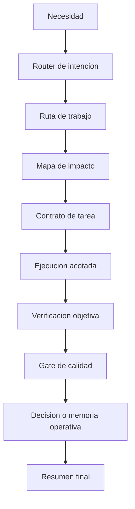

# Agent Operating Model

Este documento define el proceso operativo para abordar necesidades con agentes en el MVP de monitoreo de flotas. Complementa `AGENTS.md`, `docs/agent-modes.md` y los prompts versionados en `docs/prompts/`.

## Principio central

El agente no solo ejecuta tareas. Opera con contrato, evidencia, verificacion y memoria acumulativa del proyecto.

Cada necesidad debe producir una de estas salidas:
- cambio implementado y verificado
- diagnostico con evidencia
- decision documentada
- bloqueo explicito con causa y siguiente paso

## AgentOps Loop



## 1. Router de intencion

Antes de planear o tocar codigo, el orquestador clasifica la necesidad.

Preguntas minimas:
- Es bug, feature, arquitectura, deuda tecnica, exploracion, incidente o entrega?
- Afecta backend, frontend, mobile, infra, AI, observabilidad o docs?
- Requiere un solo agente o varios especialistas?
- Es reversible, riesgosa o transversal?
- Cambia contratos, datos, seguridad, despliegue o experiencia de usuario?

Salida esperada:

```text
Tipo:
Frentes impactados:
Riesgo:
Ruta de trabajo:
Verificacion esperada:
```

## 2. Rutas de trabajo

### Ruta rapida

Usar para cambios pequenos, bajo riesgo y una sola area.

Condiciones:
- un frente principal
- sin cambio de arquitectura
- verificacion directa
- documentacion solo si cambia comportamiento visible

Salida:
- implementacion pequena
- build, test o validacion puntual
- resumen breve

### Ruta estandar

Usar para features, bugs o mejoras con impacto real en el producto.

Condiciones:
- una o dos areas impactadas
- puede requerir test nuevo o ajuste de docs
- riesgo bajo o medio

Salida:
- mapa de impacto
- contrato de tarea
- cambio implementado
- verificacion
- docs si aplica

### Ruta arquitectura

Usar cuando la necesidad cambia decisiones, contratos o responsabilidades.

Condiciones:
- impacto transversal
- afecta backend, frontend, infra, AI o mobile en conjunto
- requiere explicitar alternativas

Salida:
- decision documentada
- alternativas consideradas
- impacto por frente
- plan de migracion o adopcion
- verificacion posible

### Ruta incidente

Usar para fallos, regresiones, errores de build, degradacion o comportamiento inesperado.

Condiciones:
- hay un sintoma observable
- se necesita reproducir antes de corregir
- el cierre requiere evidencia del fix

Salida:
- sintoma
- reproduccion
- causa probable o confirmada
- fix minimo
- prueba de regresion o comando de verificacion

### Ruta exploracion

Usar cuando el objetivo es investigar, comparar opciones o definir direccion.

Condiciones:
- no se debe tocar codigo todavia
- el valor esta en entender opciones
- se necesita recomendacion o plan

Salida:
- hallazgos
- opciones
- recomendacion
- riesgos
- siguiente tarea implementable

## 3. Mapa de impacto

Antes de implementar, el agente debe identificar el radio de cambio.

Formato recomendado:

```text
Impacto probable:
- Backend:
- Frontend:
- Mobile:
- Infra / CI-CD:
- Observabilidad:
- AI agent:
- Docs:

Contratos afectados:
- API:
- Eventos:
- Datos:
- Variables de entorno:

Riesgo principal:
Verificacion minima:
```

Reglas:
- Si el cambio toca telemetry, RabbitMQ o TimescaleDB, validar que se mantiene el diseno event-driven.
- Si el cambio toca dashboard, validar que la UI consume read models del backend y no mueve reglas de negocio al frontend.
- Si el cambio toca AI, validar que el agente no inventa datos y usa tools internas para hechos operativos.
- Si el cambio toca mobile, validar que el flujo offline-first y sync siguen aislados salvo contratos compartidos.
- Si el cambio toca infra, documentar una ruta de validacion y rollback.

## 4. Contrato de tarea

Cada frente o especialista debe trabajar con un contrato cerrado.

```text
Objetivo:
Alcance:
No tocar:
Areas o archivos probables:
Criterios de aceptacion:
Verificacion:
Rollback o fallback:
Documento a actualizar:
```

Uso:
- el orquestador define el contrato
- el especialista ejecuta dentro del alcance
- el revisor valida contra criterios de aceptacion
- el guardian de documentacion registra cambios relevantes

## 5. Presupuesto de fases

El agente debe evitar discovery infinito y cambios demasiado amplios.

Presupuesto recomendado:

| Fase | Limite operativo | Salida |
| --- | --- | --- |
| Discovery | archivos relevantes, no todo el repo | mapa de impacto |
| Plan | maximo 5 decisiones | contrato de tarea |
| Implementacion | cambio minimo funcional | diff acotado |
| Verificacion | comando o razon explicita | evidencia de cierre |
| Documentacion | solo comportamiento, arquitectura o runbook | md actualizado |

Si el presupuesto no alcanza, el agente debe cerrar con bloqueo explicito o proponer una siguiente tarea mas pequena.

## 6. Matriz de especialistas

| Frente | Especialista | Entregable esperado | No debe hacer |
| --- | --- | --- | --- |
| Backend / eventos | Backend / Events Specialist | endpoint, service, worker, contrato o test | reemplazar RabbitMQ o duplicar reglas en read models |
| AI agent | AI Agent Specialist | tool, intent router, traza o respuesta estructurada | inventar datos de flota |
| Portal | Frontend Operations Specialist | dashboard, mapa, alertas, chat o hook | mover reglas de negocio al frontend |
| Mobile / edge | Mobile / Edge Specialist | captura, cola offline, sync o estado de sincronizacion | mezclar flujo mobile con portal sin contrato |
| Infra / SRE | Infra / SRE Specialist | Compose, k6, CI/CD, Terraform o health path | dejar cambios sin validacion o rollback |
| Observabilidad | Infra / SRE o Backend | logs, health, metrics, correlation id | crear senales que no se puedan consultar |
| Docs | Doc Steward / Orchestrator | decision, runbook, roadmap o prompt | documentar aspiraciones como si ya existieran |

## 7. Matriz de verificacion

| Tipo de cambio | Verificacion minima |
| --- | --- |
| Backend | `cd backend && npm.cmd test` o test focal si aplica |
| Backend build | `cd backend && npm.cmd run build` si existe script |
| Frontend | `cd frontend && npm.cmd test && npm.cmd run build` |
| Mobile | `cd mobile && npm.cmd run typecheck && npm.cmd test` |
| Infra Compose | `cd infra && docker compose config` o `docker compose up --build` segun alcance |
| Integracion real | `cd backend && npm.cmd run test:integration` |
| AI agent | tests de agent, trazas auditables y no invencion de datos |
| Docs | revision de links, consistencia con README/arquitectura |

En este workspace Windows con PowerShell, usar `npm.cmd` para comandos Node. `npm` puede resolver a `npm.ps1` y fallar por politica de ejecucion aunque el proyecto este correcto.

Si un comando no se puede ejecutar, registrar:
- comando intentado
- causa
- riesgo residual
- verificacion alternativa

## 8. Gates de calidad

Antes de cerrar una tarea, el agente debe pasar estos gates.

```text
Gate 1. La necesidad esta clasificada.
Gate 2. El cambio tiene alcance acotado.
Gate 3. La implementacion respeta la arquitectura actual.
Gate 4. La verificacion fue ejecutada o justificada.
Gate 5. La documentacion se actualizo cuando cambio comportamiento.
Gate 6. Riesgos, pendientes y siguiente paso quedaron explicitos.
```

Para trabajo serio o coordinado, agregar:

```text
Gate 7. Cada especialista tuvo contrato propio.
Gate 8. El orquestador integro y resolvio inconsistencias.
Gate 9. No hay decisiones finales tomadas por especialistas aislados.
```

## 9. Memoria operativa

Cuando una tarea cambie arquitectura, proceso, contratos, prompts, infraestructura o comportamiento relevante, registrar una memoria corta en el documento afectado o en una seccion de decision.

Formato:

```text
Decision:
Fecha:
Contexto:
Motivo:
Alternativas descartadas:
Archivos afectados:
Como verificar:
Riesgo futuro:
```

Regla:
- README describe el estado actual.
- `docs/architecture.md` describe arquitectura.
- `docs/ia-audit.md` describe trazabilidad del agente IA.
- `docs/local-runbook.md` describe ejecucion local.
- `docs/continuous-deployment.md` describe CI/CD y despliegue.
- `docs/agent-operating-model.md` describe como trabajan los agentes.

## 10. Indicadores del agente

Para optimizar recursos, el cierre de tareas amplias debe reportar los indicadores que apliquen.

```text
Ruta usada:
Frentes impactados:
Archivos modificados:
Tests/builds ejecutados:
Docs actualizados:
Riesgo residual:
Siguiente tarea recomendada:
```

Estos indicadores permiten comparar si el agente esta siendo rapido, verificable y consistente.

## Ejemplo de contrato

```text
Objetivo:
Mejorar alertas del dashboard para reflejar vehiculos detenidos en zonas criticas.

Alcance:
Frontend dashboard y endpoint de lectura existente.

No tocar:
Contratos de eventos, RabbitMQ, TimescaleDB ni simulador.

Areas probables:
frontend/src/components/dashboard/AlertsPanel.tsx
frontend/src/hooks/useFleetDashboard.ts
docs/local-runbook.md

Criterios de aceptacion:
Las alertas usan el read model del backend y el mapa/resumen conservan la misma fuente de verdad.

Verificacion:
cd frontend && npm test && npm run build

Rollback o fallback:
Revertir cambios del panel de alertas sin alterar contratos backend.

Documento a actualizar:
docs/local-runbook.md si cambia el flujo de validacion.
```
