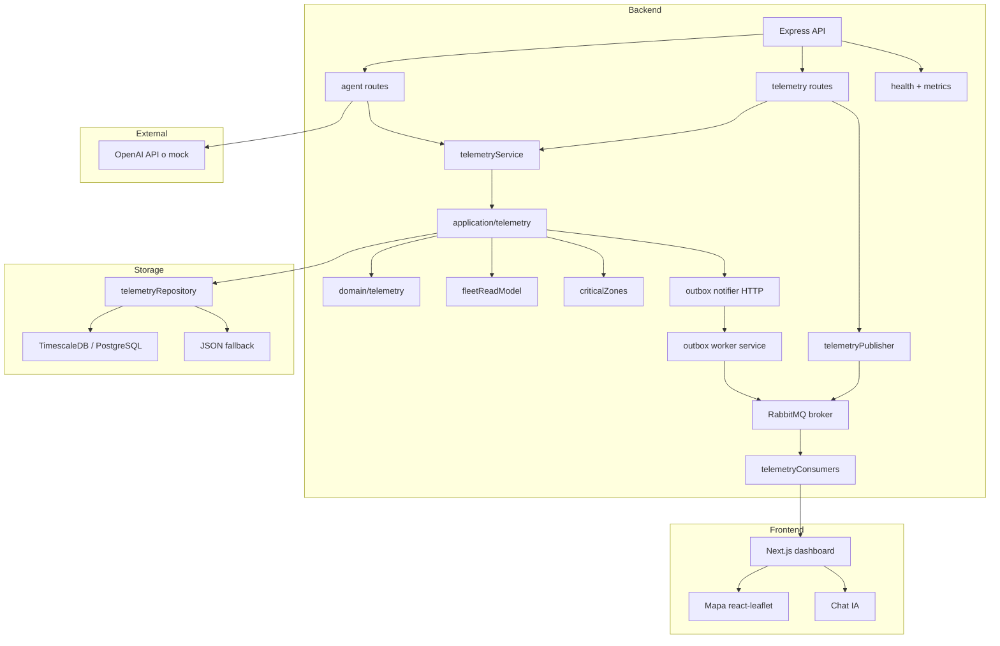

# Arquitectura del MVP

## Vision general
El proyecto ya no es solo un prototipo de pantalla. La base actual es un portal operativo para flotas con:
- ingesta de telemetria por HTTP con soporte de lote
- broker RabbitMQ administrado en AWS para el despliegue real, con fallback en memoria para desarrollo local
- persistencia principal en TimescaleDB/PostgreSQL
- outbox persistente con worker de reintentos para la publicacion
- worker de outbox independiente con notificador HTTP y circuit breaker
- capa de aplicacion para telemetria con casos de uso explicitos
- read models para flota, vehiculos y zonas criticas
- dashboard Next.js con mapa, alertas, salud y chat IA
- agente IA integrado al backend con tools internas
- trazas persistidas de agente y conversaciones por `conversationId`
- observabilidad basica con health, metrics y request ids

## Stack tecnologico
| Capa | Tecnologia | Rol |
| --- | --- | --- |
| Runtime backend | Node.js 18+ + TypeScript | API principal y procesamiento de telemetria |
| Dominio | TypeScript puro en `backend/src/domain` | Validacion y normalizacion de telemetria |
| Web backend | Express + ws | REST + WebSocket para tiempo real |
| Broker | RabbitMQ administrado en AWS | Publicacion y consumo de eventos de telemetria |
| Persistencia | TimescaleDB sobre PostgreSQL | Serie temporal principal |
| Fallback local | JSON en `backend/data/events.json` | Continuidad de desarrollo cuando no hay DB |
| IA | LangChain + proveedor OpenAI + modo mock | Agente operativo con tool calling |
| Frontend | Next.js 13.4 + React 18 | Dashboard operacional |
| Mapa | react-leaflet + leaflet | Visualizacion geografica de la flota |
| Infra | Docker Compose + Terraform + GitHub Actions | Stack local reproducible y despliegue AWS base |
| Load testing | k6 | Prueba de carga por lote con 10% duplicados y 5% errores simulados |

## Arquitectura implementada

## Flujo de telemetria
1. Un dispositivo o el simulador llama `POST /api/telemetry/event` o `POST /api/telemetry/events/batch`.
2. `application/telemetry` valida y normaliza el payload antes de persistirlo.
3. `telemetryRepository` guarda en TimescaleDB y registra la entrada equivalente en el outbox persistente.
4. El API notifica al worker por HTTP con circuit breaker; si falla, el outbox sigue garantizando durabilidad.
5. El worker independiente reclama entradas pendientes y publica el mensaje en RabbitMQ con reintentos y backoff.
6. `registerTelemetryConsumers()` difunde el evento al WebSocket `/ws` desde un consumidor dedicado.
7. El frontend refresca estado, alertas y mapa.

## Flujo de outbox reforzado
1. Un dispositivo o el simulador llama `POST /api/telemetry/event` o `POST /api/telemetry/events/batch`.
2. `application/telemetry` valida y normaliza el payload antes de persistirlo.
3. `telemetryRepository` guarda el evento en TimescaleDB y registra la entrada equivalente en el outbox persistente.
4. El worker independiente reclama entradas pendientes y publica el mensaje en RabbitMQ con reintentos y backoff.
5. `registerTelemetryConsumers()` difunde el evento al WebSocket `/ws` desde un consumidor dedicado.
6. El frontend refresca estado, alertas y mapa.

### Puntos tecnicos actualizados
- La persistencia primaria usa `backend/src/storage/pg.ts`.
- El fallback local vive en `backend/src/storage/db_json.ts`.
- El outbox persistente vive en `backend/src/storage/telemetryOutbox.ts`.
- El notificador HTTP vive en `backend/src/events/outboxNotifier.ts`.
- El worker de reintentos vive en `backend/src/events/outboxWorker.ts`.
- El proceso independiente del worker vive en `backend/src/worker.ts`.
- La publicacion no bloquea la respuesta HTTP porque se delega al outbox worker.

### Puntos tecnicos del flujo
- La persistencia primaria usa `backend/src/storage/pg.ts`.
- El fallback local vive en `backend/src/storage/db_json.ts`.
- La publicacion de eventos vive en `backend/src/events/telemetryPublisher.ts`.
- El consumo para WebSocket vive en `backend/src/events/telemetryConsumers.ts`.
- La publicacion no bloquea la respuesta HTTP y se mide con contadores de exito/error.
- La validacion y normalizacion de eventos vive en `backend/src/domain/telemetry.ts`.
- La orquestacion de casos de uso vive en `backend/src/application/telemetry`.
- El simulador local vive en `backend/src/simulator/telemetrySimulator.ts`.

## Read models operativos
El backend expone vistas derivadas en lugar de obligar al frontend a reconstruir reglas de negocio.

### Flota
- `getFleetState()` normaliza estado, velocidad y ultimos timestamps.
- `getFleetSnapshot()` devuelve vehiculos normalizados y resumen en una sola llamada.
- `getFleetSummary()` resume moving, stopped, offline y online.
- `getVehicleDetail()` devuelve el estado derivado y el ultimo evento.

### Zonas criticas
- `criticalZones.ts` define el catalogo fijo de zonas monitoreadas.
- `findCriticalZoneForVehicle()` calcula pertenencia por distancia Haversine.
- `calculateStoppedSince()` detecta la racha continua detenida.
- `getStoppedVehiclesInCriticalZones()` combina geofencing y tiempo detenido.

### Endpoints relevantes
- `GET /api/telemetry/state`
- `GET /api/telemetry/summary`
- `GET /api/telemetry/vehicle/:id/detail`
- `GET /api/telemetry/critical-zones`
- `GET /api/telemetry/critical-zones/vehicles`
- `GET /api/telemetry/critical-zones/stopped?minMinutes=20`
- `GET /api/telemetry/admin/outbox`
- `GET /api/telemetry/admin/outbox/config`
- `POST /api/telemetry/admin/outbox/dead-letters/prune`
- `GET /api/telemetry/admin/ingestion`
- `GET /api/telemetry/admin/retention`

## Flujo del agente IA
1. El frontend envia una pregunta a `POST /api/agent/query`.
2. El backend arma contexto minimo con `fleetSummary` y una muestra de vehiculos.
3. El backend rehidrata los ultimos turnos del `conversationId` si existe.
4. `queryAgent()` decide entre mock local y llamada a LangChain/OpenAI.
5. Si el modelo pide una funcion, `runTool()` ejecuta una herramienta del backend.
6. El backend persiste la traza del turno y devuelve JSON estructurado para que el frontend lo pinte sin parseos fragiles.

### Herramientas actuales del agente
- `getFleetState`
- `getFleetSummary`
- `getVehicleDetail`
- `getVehicleEvents`
- `getStoppedVehicles`
- `getCriticalZones`
- `getVehiclesInCriticalZones`
- `getStoppedVehiclesInCriticalZones`

## Observabilidad y resiliencia
- `GET /health` reporta broker, base y estado general.
- `GET /metrics` expone contadores y tiempos promedio de respuesta.
- `GET /api/telemetry/admin/outbox` expone backlog, retries, bloqueos por backoff y dead letters del outbox sin requerir acceso directo a storage.
- `GET /api/telemetry/admin/outbox/config` expone intervalo de polling, limite de claim, lock timeout y politicas efectivas de retry/backoff del worker.
- `POST /api/telemetry/admin/outbox/dead-letters/prune` permite simular por defecto o ejecutar explicitamente la limpieza de dead letters historicos por ventana de antiguedad.
- `GET /api/telemetry/admin/ingestion` expone eventos recibidos, unicos aceptados, insertados, actualizados por idempotencia, duplicados de batch y entradas de outbox creadas o saltadas.
- `GET /api/telemetry/admin/retention` expone la politica efectiva de retencion Timescale y compactacion JSON.
- Cada request recibe `x-request-id`.
- Broker, worker y DB usan retries y circuit breaker simple.
- Si RabbitMQ o PostgreSQL no responden, el sistema sigue operativo en modo degradado.

## Infraestructura local
`infra/docker-compose.yml` hoy levanta:
- backend
- worker
- frontend
- simulator
- TimescaleDB
- RabbitMQ

Esto permite probar el ciclo completo de telemetria sin dependencias externas obligatorias.

`infra/terraform-bootstrap/` crea el backend remoto de Terraform en S3 y DynamoDB.
`infra/terraform/` ya contiene una base AWS minima con VPC, subredes, ALB, ECS/Fargate, ECR, service discovery, RDS PostgreSQL y Amazon MQ RabbitMQ. La deployment workflow usa estado remoto en S3 con lock en DynamoDB para que `terraform apply` sea repetible.

## Prueba de carga
`infra/loadtest/telemetry.k6.js` ya genera:
- tasa constante de eventos
- lotes de telemetria
- eventos duplicados
- eventos invalidos

Sirve como base para validar capacidad, errores y comportamiento bajo carga.

Con el lote ya tenemos una ruta mucho mas realista para probar 10.000 vehiculos sin depender de 10.000 requests por ciclo.

## Brechas abiertas
1. Falta validar el rendimiento real de TimescaleDB y RabbitMQ con mas volumen.
2. Falta mobile offline-first con sincronizacion por lotes.
3. Falta completar la conexion de secrets y ejecutar el apply real en AWS, aunque IaC y la pipeline de ECR ya tienen una base real en Terraform y GitHub Actions.
4. Falta observabilidad mas profunda con logs estructurados y trazas.
5. Falta validar la estrategia del worker bajo carga extrema con resultados de k6.
